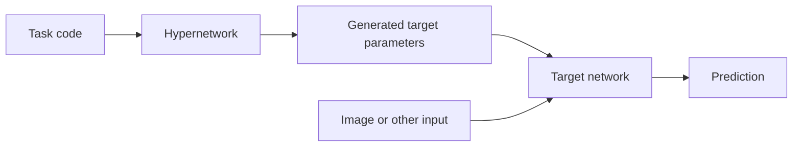

# Concepts and processes: FAQ

This guide explains the ideas behind hypernetworks, continual learning, and
machine unlearning. Examples are illustrative. Settings such as head counts,
chunk budgets, loss coefficients, and success thresholds belong to individual
methods; they are not universal rules.

## Contents

1. [Neural network basics](#neural-network-basics)
2. [Hypernetworks](#hypernetworks)
3. [Heads and chunks](#heads-and-chunks)
4. [Architecture details](#architecture-details)
5. [Continual learning](#continual-learning)
6. [Machine unlearning](#machine-unlearning)
7. [Preservation and optimization](#preservation-and-optimization)
8. [Evaluating forgetting](#evaluating-forgetting)
9. [Designing experiments](#designing-experiments)
10. [Reproducibility and workflow](#reproducibility-and-workflow)

## Neural network basics

### What are parameters, weights, and activations?

Parameters are adjustable numbers that define a model's computation. Weights
and biases are parameters. Activations are intermediate values computed for an
input.

For `y = w*x + b`, `w` and `b` are parameters. The computed `y` is an activation.
Changing the input changes activations even when the parameters stay fixed.

### What is a loss function?

A loss is a numerical objective used to train a model. A classification loss
penalizes incorrect predictions. Other losses can penalize changes to parameters
or predictions. Accuracy counts correct answers; a loss can also respond to how
confident those answers are.

### What is a gradient, and what does the optimizer do?

A gradient describes how the loss changes with each trainable parameter. For a
small change, it predicts the direction and rate of loss change. Backpropagation
computes these derivatives through the network.

An optimizer uses gradients to update parameters. Basic gradient descent
subtracts the gradient multiplied by a learning rate. A gradient is therefore
not itself the parameter update. See the
[PyTorch autograd tutorial](https://docs.pytorch.org/tutorials/beginner/basics/autogradqs_tutorial.html).

### What are a batch, a step, and an epoch?

A batch is a group of examples processed together. An optimizer step updates
parameters. An epoch is one pass through the training data. Gradient accumulation
can combine several batches into one optimizer step, so batches and steps need
not be equal.

## Hypernetworks

### What is a hypernetwork?

A hypernetwork generates parameters for another network, called the target
network. The target network uses those parameters to process inputs and make
predictions. The hypernetwork itself has trainable parameters too. See the
[HyperNetworks paper](https://arxiv.org/abs/1609.09106).

### What is a task embedding?

A task embedding is a vector that identifies or describes a task to the
hypernetwork. Different task vectors can produce different target parameters.
The method determines whether these vectors are learned or fixed.

The vector is not a complete task model by itself. Its meaning depends on the
hypernetwork that processes it.

### Does each task have its own model?

It can have its own generated parameter set while sharing the same target
architecture and hypernetwork. Those parameter sets can be generated when
needed instead of all being stored as independent models. Shared generation
also means that changing the hypernetwork can affect several tasks. This is the
setup studied in [Continual learning with hypernetworks](https://arxiv.org/abs/1906.00695).

### Which parameters get updated during training?

For a generated layer, the loss can backpropagate through its generated weights
into the hypernetwork. The optimizer updates the registered trainable parameters,
such as hypernetwork weights and any trainable embeddings. Some designs also
have target parameters that are trained directly. Check which parameters the
optimizer actually owns.

## Heads and chunks

### What is an output head?

An output head is a branch that produces a particular output. In a classifier,
it may produce class scores. In a hypernetwork, it may produce a group of target
parameters. A shared trunk computes features used by several heads.

Three parameter heads still contribute to one target model. They do not imply
three tasks or three classifiers.

### Are BatchNorm parameters and shortcut parameters also weights?

They are all model parameters. A grouping named "BatchNorm, residual, weights"
uses "weights" as shorthand for the remaining parameters. More explicit names
would be "normalization parameters, shortcut-projection parameters, and other
parameters."

The group names describe an implementation choice. They do not define three
different kinds of knowledge.

### What is chunked parameter generation?

The hypernetwork produces portions of the target parameter vector. A chunk code
identifies which portion to generate, while the task code identifies the task.
The portions are assembled into the tensors expected by the target model.

A chunk need not correspond to one layer. Chunking can reduce the required
output width, but it does not guarantee that the hypernetwork is smaller than
its target. See the [chunking description](https://arxiv.org/html/1906.00695v4#S2.SS2).

### What does a 200-chunk budget mean?

It means a design uses 200 portions to generate the required parameters. It does
not mean 200 parameters, layers, or tasks.

For example, if three groups own 2%, 18%, and 80% of the parameters, proportional
allocation gives 4, 36, and 160 chunks. Real allocations need integer rounding
and may require at least one chunk for each nonempty group. Chunk lengths and
padding depend on the implementation.

### Why use separate heads, and does every architecture need three?

Separate heads allow different output sizes or treatments for different
parameter groups. This adds design choices that should be tested. One head,
three heads, or another grouping may be appropriate. An architecture without
shortcut projections has no shortcut-projection parameters to generate.

## Architecture details

### What is a residual connection?

A residual block combines a learned transformation with a shortcut:

`output = F(x) + shortcut(x)`

When the shapes match, the shortcut can be `x` itself. This identity shortcut
has no learned parameters. The residual activations `F(x)` are computed from the
input; they are not a separate set of generated weights.

### When does a shortcut need a projection?

The two values being added must have compatible shapes. A common way to handle
a change in channels or spatial size is a learned projection on the shortcut,
often a 1-by-1 convolution with a suitable stride.

For example, a shortcut may transform a 64-channel input into 128 channels before
addition. These projection weights can be generated by a hypernetwork. Other
shape-matching strategies also exist. See the
[ResNet paper, section 3.2](https://arxiv.org/html/1512.03385v1#S3.SS2).

### What does BatchNorm learn, and what does it store?

BatchNorm normalizes activations and can apply a learned scale and offset per
channel. With running-statistic tracking enabled, it also stores running means
and variances for evaluation.

The learned scale and offset are parameters. Running means and variances are
buffers updated from data rather than by ordinary gradient descent. Generating
the parameters does not automatically supply the right buffers. See the
[BatchNorm documentation](https://docs.pytorch.org/docs/main/generated/torch.nn.BatchNorm2d.html).

### What changes with another architecture?

The generator must match the target's actual tensor names, shapes, and parameter
types. A plain multilayer perceptron might have only linear weights and biases.
A transformer may include attention projections and LayerNorm parameters.
Residual addition alone does not imply a learned shortcut projection.

## Continual learning

### What is a task?

A task is a learning problem defined by an experiment. Tasks may differ in
classes, input distributions, or transformations. The protocol must say whether
task identity is available when making predictions. Knowing the task can make
the problem substantially different from predicting across all tasks together.

### What is catastrophic forgetting?

It is a substantial loss of previously learned performance while learning new
information. Updating shared parameters for a new task can disrupt computations
needed by earlier tasks. It is an unintended outcome of learning. See
[Overcoming catastrophic forgetting in neural networks](https://arxiv.org/abs/1612.00796).

### How do replay, regularization, and task-specific parameters help?

Replay trains on examples representing earlier tasks. Regularization penalizes
changes considered harmful to earlier tasks. Task-specific parameters give tasks
some separate capacity. Each approach makes different demands on storage,
computation, and access to previous data. None removes the need to measure
retained performance.

## Machine unlearning

### What is machine unlearning?

Machine unlearning aims to remove specified training influence from a model.
The removal request might concern examples, a class, or a task. The definition
of success must specify what is being removed and what behavior should remain.
The [Machine Unlearning paper](https://arxiv.org/abs/1912.03817) gives an example
of a training design that supports later removal requests.

### How is intentional forgetting different from catastrophic forgetting?

Intentional forgetting targets specified information while preserving useful
remaining behavior. Catastrophic forgetting is unwanted loss during learning.
A model that becomes poor at every task has not demonstrated selective
unlearning.

### Is unlearning the same as training without the removed data?

Training from scratch without the removed data is a useful reference for many
unlearning definitions. Exact unlearning can require matching the distribution
of models produced by that training procedure. Approximate methods aim for a
specified weaker comparison. The reference model need not score at chance on
removed examples: it may generalize to them from retained data. For a formal
comparison with training that excluded the data, see
[Certified Data Removal](https://arxiv.org/abs/1911.03030).

### Does data-free forgetting mean no data is needed anywhere?

Usually it describes the inputs required by the forgetting procedure. Training,
evaluation, or later diagnostic probes may still use data. A paper should state
which stage avoids which data, and what saved state it requires instead.

## Preservation and optimization

### What is a preservation loss?

It penalizes changes to something we want to retain. Depending on the method,
that could be parameters, generated parameters, features, or predictions.

For a generated parameter vector `w` and saved reference `w_ref`, one possible
penalty is `L_preserve = sum((w - w_ref)^2)`. This directly constrains parameter
distance. It does not directly constrain classification accuracy.

### What are preservation gradients?

They are derivatives of the preservation loss with respect to the parameters
being trained. The optimizer uses them to reduce the measured change.

For the single-number loss `(w - 2)^2`, the gradient at `w = 3` is `2`. Gradient
descent subtracts a positive amount, moving `w` toward the reference value `2`.
With a hypernetwork, the chain rule carries this signal through generated `w`
to the hypernetwork's own parameters.

### Why can preservation gradients start at zero?

For a squared-distance penalty, if the current output exactly matches its saved
reference, both the loss and its gradient are zero. After another objective
changes the output, preservation can become nonzero. This explanation depends
on the chosen penalty and the reference actually matching the starting state.

### How do several losses combine?

For fixed coefficients, if `L = a*L_forget + b*L_preserve`, then
`gradient(L) = a*gradient(L_forget) + b*gradient(L_preserve)`.

The optimizer receives the combined gradient. Separate measurements help show
which objective contributes to it. State whether reported gradients already
include their coefficients.

### What do gamma, beta, and the learning rate control?

Names such as gamma and beta have no universal meaning. Read their definitions
in the objective. A loss coefficient changes the contribution of one term;
the learning rate controls the optimizer's update scale.

Changing one term's coefficient can change the combined gradient's direction.
It is generally not equivalent to changing the learning rate.

### What does a gradient norm tell us?

An L2 norm summarizes a gradient's size. It does not show its direction, and
groups with different parameter counts are not automatically comparable.

Two gradients of size 10 could add to size 20 if aligned, cancel if opposite,
or combine to about 14.1 if perpendicular. Cosine similarity measures their
alignment when both gradients are nonzero. Norms alone cannot establish
conflict or cancellation.

### Why can Adam updates differ from the raw gradients?

Adam uses running estimates of gradients and squared gradients to compute
updates. Its optimizer state therefore matters. Clipping and weight decay can
also affect an update, depending on the configuration. Measure actual parameter
changes when the question concerns how far the model moved. See the
[Adam paper](https://arxiv.org/abs/1412.6980).

### Does matching random noise necessarily produce random weights?

No. Consider squared error from a deterministic output `w` to fresh noise `z`.
Its expected value is `E[(w-z)^2] = (w-E[z])^2 + Var(z)`. This is minimized at
the noise mean. For zero-mean noise, that mean is zero.

Matching one fixed random target is a different objective. Increasing the
number of fresh samples can reduce gradient variability without changing the
expected optimum. This calculation describes that particular loss, not every
noise-based forgetting method.

## Evaluating forgetting

### What are target accuracy, retained accuracy, and drift?

Target accuracy measures performance on the requested forgetting target.
Retained accuracy measures performance on tasks that should remain useful.
Drift is a change from a stated reference.

For example, a change from 60% to 57% is a signed drift of -3 percentage points
or an absolute drift of 3 points. A retained-task average can hide a large loss
on one task, so also inspect individual tasks.

### What is chance accuracy?

Uniform random guessing among `K` possible classes has expected accuracy `1/K`.
For ten classes, that is 10%. Other uninformed baselines depend on class
frequencies and prediction rules. State which classes the evaluator allows the
model to predict.

### Does chance-level accuracy prove knowledge was removed?

No. Low accuracy describes behavior under a particular evaluation. Useful
features or other recoverable information may remain. Conversely, useful
generalization from retained data can produce above-chance accuracy without
requiring direct training on the removed examples. Evaluation must match the
removal claim. See the study on
[unlearning evaluation protocols](https://arxiv.org/abs/2503.06991).

### Why measure relearning?

Relearning measures how performance recovers when training resumes on the
forgotten task. Fast recovery can motivate further investigation, but it may
also reflect useful features shared with other tasks. Compare matched training
budgets and appropriate reference models. A recovery curve is more informative
than a single final accuracy.

### What does a never-seen control task test?

It helps distinguish recovery specific to a previously learned task from a
general ability to learn new tasks. Match task difficulty, data quantity, and
adaptation procedure as closely as possible. "Never seen" means absent from
the relevant training history; it does not guarantee equal difficulty.

### What do component freezing and Fisher information tell us?

Freezing keeps selected parameters fixed during adaptation. Comparing different
freeze choices tests which trainable components are sufficient for recovery
under that procedure. Fixed components may still supply useful features.

Fisher information measures local sensitivity of a probabilistic model. It can
help weight parameter changes, as in
[elastic weight consolidation](https://arxiv.org/abs/1612.00796). A large value
does not by itself locate stored task knowledge. State how it was estimated
before comparing values.

## Designing experiments

### What are a baseline, a control, an ablation, and a diagnostic?

| Term | Purpose | Example |
| --- | --- | --- |
| Baseline | Provide a reference result | Train the target model directly |
| Control | Check an alternative explanation | Adapt to a matched never-seen task |
| Ablation | Test the contribution of a component | Remove the preservation penalty |
| Diagnostic | Inspect a suspected mechanism | Measure gradient alignment |

### Should experiments start with a small model or the final setting?

Use a small model to check shapes, gradients, saving, restoration, and evaluation
quickly. Use the intended setting to test claims that depend on architecture,
data, or scale. An existing trained checkpoint may make a diagnostic on a large
model cheaper than starting a new small-model training run.

Estimate total work from examples, epochs, batch size, time per step, and
evaluation cost. A smaller image dataset is not automatically cheaper under
every training setup.

### Why compare runs from the same checkpoint?

It holds the learned starting state fixed, making differences easier to
attribute to the setting being tested. Independent training runs can begin with
different accuracies and representations. Both designs are useful, but answer
different questions.

### Why repeat across seeds and keep a separate test set?

Repeated seeds reveal variation from initialization, data order, and other
random choices. Validation data supports tuning. A separate test set checks
the selected procedure after tuning. Repeatedly selecting settings on test
results makes that set part of the tuning process.

### When should success criteria be chosen?

Choose the metric, reference, threshold, and evaluation budget before comparing
candidate runs. If the criterion changes during exploration, document the
change and validate it on fresh evidence. A diagnostic threshold is a practical
decision rule; it is not automatically a scientific guarantee.

## Reproducibility and workflow

### What must a checkpoint contain?

For inference, save the model state, required buffers, configuration, and any
external task state. For faithful training continuation, also save optimizer and
scheduler state, progress, relevant random-generator states, and mixed-precision
state when used. Data-order state may also be needed. See the
[PyTorch checkpoint guide](https://docs.pytorch.org/tutorials/beginner/saving_loading_models.html).

### Why record both a commit and local changes?

A commit identifies a saved repository version. A diff describes changes
relative to a base. Record the base commit and any changes used for the run,
including new files, plus the actual configuration. Ordinary `git diff` omits
staged changes and untracked files; it is not a complete experiment snapshot.
See the [Git diff documentation](https://git-scm.com/docs/git-diff).

### Is setting one random seed enough?

Not always. Data shuffling, augmentation, initialization, and noise sampling
may use different generators. Unrelated operations can consume a shared random
stream. Separate streams help isolate these effects. Hardware, software versions,
and nondeterministic operations can still affect results. See
[PyTorch reproducibility guidance](https://docs.pytorch.org/docs/main/notes/randomness.html).

### Which notebook cells should run once, and which should run again?

Session setup usually installs dependencies, mounts storage, and loads code.
Each independent run should explicitly load its intended starting state, apply
its configuration, execute, evaluate, and save results. A resumed run instead
restores its continuation state.

Repeated notebook execution can otherwise reuse a modified model, stale imports,
or optimizer history. Keep reusable logic in versioned functions and make the
notebook show the configuration and actions being taken.

### What belongs in an experiment log?

Record the question, starting state, code and configuration, data splits, seeds,
hardware, measurements, timing, and saved artifacts. Separate observations from
interpretations and proposed next steps. Include failed and interrupted runs.
Mark missing values explicitly and state whether each measurement was taken
before or after an update.

Save reports and checkpoints to durable storage before ending a temporary
session. A path in a notebook output is not evidence that the file still exists.
