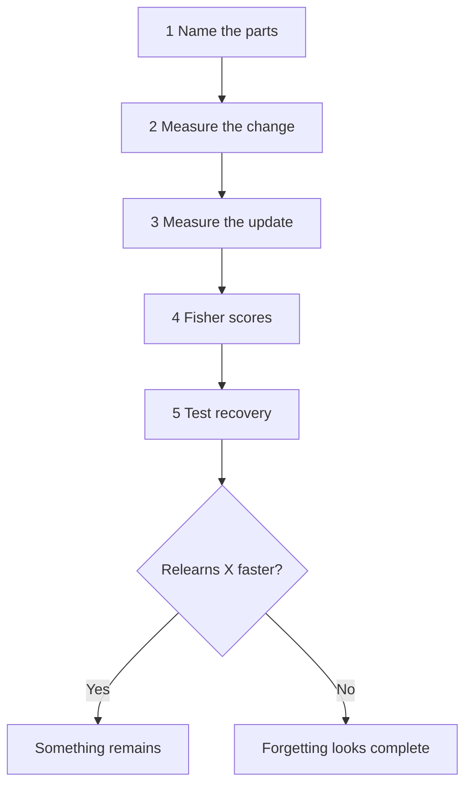

# Model diagnostic tool

## What is it?

It is a tool for looking inside a model during learning and forgetting. It
shows which weights changed, what the gradients asked them to do, and how much
the optimizer actually moved them. It can also calculate Fisher scores, which
show how strongly a chosen set of examples depends on each weight.

For our hypernetwork, we look at the task embedding, chunk embeddings, shared
layers, output heads, and saved BatchNorm statistics. Other models can use
different groups. A run report stores the measurements, but the report is only
the record of the diagnostic.

## Why is it needed?

Accuracy tells us what the model answers. It does not tell us what changed
inside. After forgetting, the model might answer task X badly while its task
embedding or BatchNorm statistics still carry information from X. Some shared
weights might also help it learn X again.

We need to see which parts changed and then test whether unchanged or partly
changed parts help X come back. This also helps us debug a failed run: we can
check whether the forgetting and preservation gradients oppose each other,
whether Adam made a meaningful update, and whether task 0 was affected.

## Novelty

Looking at weights, gradients, or Fisher scores is standard. Those measurements
alone are not our proposed contribution.

The proposed contribution is to use them in a controlled test of **what remains
after task forgetting**. We compare a model that learned and forgot X with a
matched model that never learned X. We give both the same small amount of X data
and see whether the first model relearns faster. Then we repeat the test while
freezing or replacing specific model parts. A separate task Y checks whether
any advantage is specific to X. Fisher scores help choose which weight groups
to test first; they do not prove where information is stored. BatchNorm
statistics need their own keep-versus-reset test because they are not weights.

This is the method described in the [study plan](PLAN.md). Its novelty still
needs the literature review and experiments described there. We have not
established the claim yet.

## Inner working

1. **Name the parts.** Map the model's tensors to roles such as task embedding,
   shared layers, heads, and BatchNorm statistics.
2. **Measure the change.** Save each part before forgetting and compare it with
   the same part afterward. A zero change means that part stayed the same; it
   does not prove that it stores task X.
3. **Measure the update.** At each forgetting step, measure the gradients from
   the noise and preservation terms, their alignment, and the actual Adam update.
   Gradients show the requested direction; the Adam update shows the move made.
4. **Calculate Fisher scores.** For each chosen example, compute a gradient for
   each weight, square it, and then average across examples. The empirical
   version uses the example's true class. The model-predicted version checks
   every class and weights each one by its predicted probability. We calculate
   one score per weight, called the *diagonal* Fisher. We do not calculate the
   full weight-by-weight matrix.
5. **Test recovery.** Give the forgotten-X and never-learned-X models the same
   examples and update budget. Compare their accuracy on held-out X images.
   Repeat with selected parts frozen or replaced, and run the Y control.

The code can do steps 1 to 4 as separate pieces. The
[`04_gradient_diagnostics.ipynb`](../notebooks/04_gradient_diagnostics.ipynb)
notebook records gradients, Adam updates, and before/after changes during a
forgetting run. The [inspection functions](../uncle/research_diagnostic.py)
read live weights and gradients and calculate diagonal Fisher. We still need
one runner that loads the E08 checkpoint, chooses and records the Fisher
examples, and performs the matched recovery tests in step 5. No E08 Fisher or
recovery result has been measured yet.
