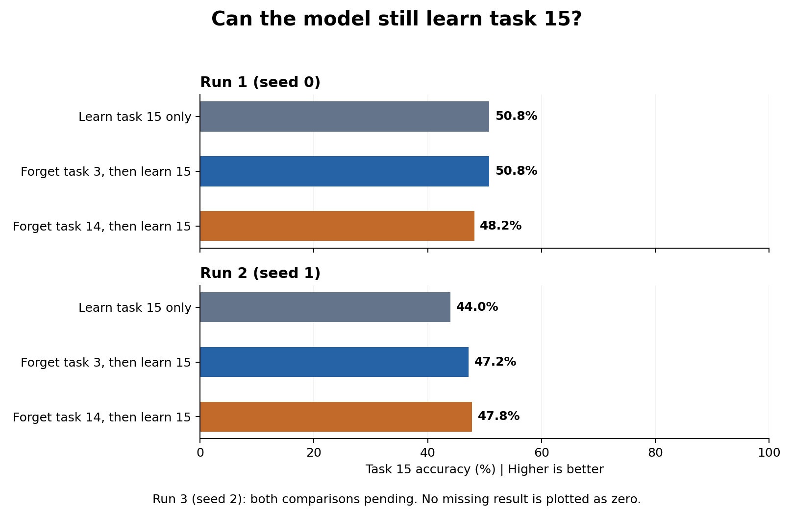

# What happens when we forget a task and then learn task 15?

**Draft, 10 October 2026. Two runs have finished; the third run is unfinished.** This report uses the saved results available at this snapshot. It does not include later training.

## What we know so far

- **Forgetting:** task 3 and task 14 both reach 10% accuracy after forgetting. They stay at 10% after learning task 15 in both completed runs.
- **Learning task 15:** the model still learns task 15. Forgetting first sometimes improves its score and sometimes reduces it. We cannot yet claim a consistent benefit.
- **Other tasks:** their average score falls slightly, but some individual tasks lose 11 to 14.2 points. A small average loss does not mean every task is protected.

These are results from two completed runs. The final average across all three runs is still pending.

## What exactly are we comparing?

First, each model learns these eight tasks in this order:

**Task 3 -> task 0 -> task 9 -> task 5 -> task 17 -> task 1 -> task 7 -> task 14**

We copy that model into three branches. Each branch starts from the same model within a run.

| Branch | What the model does | Why we run it |
| --- | --- | --- |
| Baseline | Learn task 15 only | Measure learning without a forgetting request |
| Forget task 3 | Forget task 3, then learn task 15 | Test forgetting a task learned first |
| Forget task 14 | Forget task 14, then learn task 15 | Test forgetting a task learned last |

We repeat this comparison with seeds 0, 1, and 2. A **seed** sets the random choices used in a run, including model initialization. Repeating with different seeds helps show whether a result changes with those choices. Here, Run 1 means seed 0, Run 2 means seed 1, and Run 3 means seed 2.

## 1. Did the model forget the requested task?

Accuracy is the percentage of validation images classified correctly. Each task has 10 classes, so random guessing would score about **10%**. For example, 35.6% accuracy means 178 correct answers out of 500 validation images.

| Run and task to forget | Before forgetting | After forgetting | After learning task 15 |
| --- | ---: | ---: | ---: |
| Run 1 (seed 0): task 3 | 35.6% | 10.0% | 10.0% |
| Run 1 (seed 0): task 14 | 42.6% | 10.0% | 10.0% |
| Run 2 (seed 1): task 3 | 40.4% | 10.0% | 10.0% |
| Run 2 (seed 1): task 14 | 40.4% | 10.0% | 10.0% |
| Run 3 (seed 2): task 3 | Pending | Pending | Pending |
| Run 3 (seed 2): task 14 | Pending | Pending | Pending |

**Reading this table:** in Run 1, task 3 falls from 35.6% to 10.0% after forgetting. It is still at 10.0% after the model learns task 15. The other three completed comparisons show the same final 10.0% score.

The study accepts a forgotten-task score at or below 12%. All four completed comparisons meet this threshold. None of the saved evaluations during task-15 learning rises above it. This shows reduced classification accuracy over this tested continuation. It does **not** prove that the task's information has been erased or cannot be recovered.

## 2. Could the model still learn task 15?

All numbers below are task-15 validation accuracy. Higher is better. Compare the three scores **within the same row**, because each run has its own starting model.

| Run | Learn 15 only | Forget 3, then learn 15 | Forget 14, then learn 15 |
| --- | ---: | ---: | ---: |
| Run 1 (seed 0) | 50.8% | 50.8% | 48.2% |
| Run 2 (seed 1) | 44.0% | 47.2% | 47.8% |
| Run 3 (seed 2) | Completed; score not in this comparison snapshot | **Pending** | **Pending** |

In Run 1, forgetting task 3 makes no difference: both scores are 50.8%. Forgetting task 14 gives 48.2%, which is **2.6 points lower** than the baseline.

In Run 2, forgetting task 3 gives **3.2 points higher** accuracy than the baseline. Forgetting task 14 gives **3.8 points higher** accuracy.

A **percentage point** is the difference between two percentage scores: 47.2% minus 44.0% is 3.2 points. These differences are not relative percentage improvements.

The chart shows the same scores as the table. Each bar has its accuracy written beside it. Run 3 is omitted because its scores are not yet available in this snapshot.

## 3. What happened to the other learned tasks?

Here we compare each forgetting branch with the baseline **after both have learned task 15**. We examine the seven earlier tasks that were supposed to remain learned. The requested forgotten task is excluded.

| Run and request | Average change across other tasks | Largest loss on one other task |
| --- | --- | --- |
| Run 1 (seed 0): forget 3, then learn 15 | 1.09 points lower | Task 9: 11.0 points lower |
| Run 1 (seed 0): forget 14, then learn 15 | 1.60 points lower | Task 17: 14.2 points lower |
| Run 2 (seed 1): forget 3, then learn 15 | 1.57 points lower | Task 1: 11.6 points lower |
| Run 2 (seed 1): forget 14, then learn 15 | 1.74 points lower | Task 0: 14.0 points lower |
| Run 3 (seed 2): forget 3, then learn 15 | Pending | Pending |
| Run 3 (seed 2): forget 14, then learn 15 | Pending | Pending |

**Reading this table:** in Run 1, forgetting task 3 lowers the average across the other seven tasks by 1.09 points. However, task 9 alone loses 11.0 points. Some tasks improve while others decline, so the average can hide a large loss.

The main concern is therefore the loss on individual tasks, even when task 15 learns successfully. The task with the largest loss also changes between runs.

## How much remains?

| Work | Complete | Remaining |
| --- | --- | --- |
| Training jobs | 11 of 12 | 1 branch job for Run 3 |
| Baseline-versus-forgetting comparisons | 5 of 6 | 1 comparison for Run 3 |
| Learn or forget requests | 38 of 39 | Final learn-15 request, with partial work already saved |

Progress update supplied by the user: latest verified R2 save 10 October 2026 at 22:03:47 UTC. Run 3 has finished its source model, learn-15 baseline, and forget-3/learn-15 branch. Its forget-14 request is complete; the following learn-15 request can resume. These progress counts are newer than the score snapshot above. The newly completed comparison scores have not yet been supplied or reviewed. These counts do not predict remaining GPU time.

| Final result to add | Status |
| --- | --- |
| Run 3: forget task 3, then learn task 15 | Complete; scores awaiting review |
| Run 3: forget task 14, then learn task 15 | Final learn-15 request resumable |
| Average task-15 effect across all three seeds, separately for each forgotten task | Pending |
| Average effect on other tasks, separately for each forgotten task | Pending |
| Variation across all three seeds | Pending |
| Final conclusion and total session duration | Pending |

Keep seed 2 in notebook 19 and run all to finish these branches. Then use notebook 20 on CPU to review and save the final summaries. The other sequences from the original plan are deferred and are not required for this narrowed study.

## What can this experiment support?

So far, the requested task reaches chance-level accuracy and stays there during one subsequent task. Learning task 15 remains possible, but the effect on its accuracy varies between runs. Some other tasks suffer substantial losses.

This study tests **one order and one incoming task**, not all possible sequences. Task 3 and task 14 differ in both task identity and learning position. We therefore cannot say that their differences are caused only by being learned first or last. The two forgetting branches share a baseline within each run, so they are not independent repetitions.

We will calculate the final three-seed averages when Run 3 finishes. Even three seeds provide limited evidence about how broadly the result holds. This study does not test privacy, recovery, or long future learning sequences.

## Technical details and recorded time

| Setting | Value used in this study |
| --- | --- |
| Dataset | Tiny ImageNet; 10 classes per task; partition seed 42 |
| Data per task | 5,000 training images and 500 validation images |
| Input | 64 x 64 RGB images; tensor values in [0, 1]; no augmentation or additional normalization |
| Classifier | ResNet-50; 16 bottleneck blocks; 3 x 3 stride-1 input layer; 10 outputs |
| Weight-generating network | Input width 64; hidden layers 128, 256, 512 with ReLU activation; three linear output heads |
| Task and chunk codes | 32 values each; 200 chunks of generated weights |
| Optimizer | Adam; learning rate 0.0001 for learning and forgetting |
| Learning request | 5 epochs; batch size 64; validation batch size 256 |
| Forgetting request | 100 steps; 10 Gaussian-noise samples per step |
| Loss weights | Learning protection beta 0.1; forgetting noise gamma 0.01 |
| GPU | A100 in the user-reported sessions |

The weight-generating network produces the classifier's parameters. Learning updates this network and the new task's code. Forgetting updates the network while keeping the task codes fixed. A protection loss tries to limit changes to other tasks' generated parameters. This diagnostic study uses beta 0.1, compared with the repository's paper-based Tiny ImageNet default of 0.01. It is not a paper reproduction, and older experiment-06 results are not included in these results.

The nine saved session logs total **12 h 48 m 38 s**. This is elapsed time inside the study runner, including training, evaluation, and file transfers. It excludes earlier notebook setup and time between sessions. It is not a measurement of billed GPU time. The later user-supplied session lasted 1 h 46 m 24 s. Including it brings recorded runner time to **14 h 35 m 3 s across ten sessions**; this latest session has not yet been independently reviewed from R2.

Checkpoints save after learning epochs and at 20-step forgetting boundaries. A restart resumes from the last verified R2 save; work after that save may repeat. Completed jobs are skipped.

## Detailed evidence

The four completed comparisons pass all recorded checks that the branches use matching starting models and task-15 training conditions. The [saved evidence](evidence/paired-study-2026-10-10.json) contains the exact scores, pairing checks, study plan, and session logs. The [dated experiment record](../wiki/Experiment-trajectory-2026-10-10.md) records the progress history.

For readers checking individual tasks, this table shows branch accuracy minus baseline accuracy after learning task 15, in percentage points. A plus sign means higher accuracy; a minus sign means lower accuracy.

| Task | Seed 0: U3/L15 | Seed 0: U14/L15 | Seed 1: U3/L15 | Seed 1: U14/L15 |
| --- | ---: | ---: | ---: | ---: |
| 3 | Forgotten; excluded | -2.2 | Forgotten; excluded | +4.0 |
| 0 | +10.6 | +18.6 | -5.4 | -14.0 |
| 9 | -11.0 | -7.0 | +9.8 | +4.2 |
| 5 | +4.8 | -2.4 | +4.2 | +4.6 |
| 17 | -8.0 | -14.2 | +2.6 | -0.6 |
| 1 | -6.2 | -1.0 | -11.6 | -4.0 |
| 7 | +2.2 | -3.0 | -1.4 | -6.4 |
| 14 | +0.0 | Forgotten; excluded | -9.2 | Forgotten; excluded |

Study ID: `paired_generalization_v2`. Fixed training revision: `65e2e7c850fd6f1852a99d9e81780c27f799c926`. Review snapshot: 2026-10-10T20:16:26.108265+00:00. No new training was performed for this report.
