# Experiment trajectory, 4 October 2026

*Reporting period: project start to 4 October 2026. Earlier editions are listed on the [Experiment trajectory](https://github.com/sumitasthana/CARK/wiki/Experiment-trajectory) index.*

**Status report.** Tiny ImageNet, ResNet50 backbone, Colab T4 and
A100. All figures are drawn from the evidence bundle `asof_20261004`, exported at
commit `489c9e8`.

This report traces twenty-one recorded runs in the order they were performed. For
each stage it states the question asked, the measurement obtained, and the decision
that followed.

## Contents

- [Summary](#summary)
- [Paper settings and our first full run](#paper-settings-and-our-first-full-run)
- [Definitions and evaluation criteria](#definitions-and-evaluation-criteria)
- [Stage 1. Initial full-sequence reproduction](#stage-1-initial-full-sequence-reproduction)
- [Stage 2. Isolating the learning failure](#stage-2-isolating-the-learning-failure)
- [Stage 3. Unlearning from independently trained models](#stage-3-unlearning-from-independently-trained-models)
- [Stage 4. Parameter study from a fixed checkpoint](#stage-4-parameter-study-from-a-fixed-checkpoint)
- [Stage 5. Full sequence with the selected setting](#stage-5-full-sequence-with-the-selected-setting)
- [Stage 6. Paired task-9 comparison and replay variance](#stage-6-paired-task-9-comparison-and-replay-variance)
- [Stage 7. Component-level weight audit](#stage-7-component-level-weight-audit)
- [Numerical checks](#numerical-checks)
- [Current status](#current-status)
- [Provenance and limitations](#provenance-and-limitations)

## Summary

- **Goal.** Remove one task from a trained model without degrading the tasks we
  keep.

- **Result after 21 runs.** No configuration has met the criteria. The best
  attempt reached 12.6% on the target task, against a criterion of 12% or lower,
  while the protected task moved 3.6 points.

- **Main finding.** In the full sequence, most tasks had already fallen to chance
  accuracy of 10% *before* their unlearn request ran. The model loses earlier
  tasks while learning later ones. Unlearning is therefore being tested on tasks
  that hold almost nothing. This is a continual-learning failure, not an
  unlearning failure, and it has to be fixed first.

- **Measurement is blocked.** Reruns from the same checkpoint, with identical
  settings, differ by 11 points across sessions. Any effect smaller than that
  cannot be measured today.

- **Best lead.** The loss term that protects retained tasks is roughly 0.5% of
  the total, 8.2 against 1823.6. It is too small to steer the update. A related
  numerical check suggests the unlearning term may drive outputs toward zero
  rather than toward noise.

- **What works.** The experimental pipeline. Checkpoints restore exactly, file
  hashes match, and every run records its settings, code commit, and runtime.

- **Next.** Rebalance the two loss terms and repeat the 30-step diagnostic. In
  parallel, find the cause of the cross-session variance, and measure continual
  learning on its own with no unlearn requests.

## Paper settings and our first full run

This compares the paper's Tiny ImageNet Sequence 1 with our first full run on
21 September. The paper's results average three seeds. Our result is one
reported run with seed 0.

| Setting or result | Paper | Our first full run |
| --- | ---: | ---: |
| Backbone | ResNet50 | ResNet50 |
| Generated-weight chunks | 200 | 200 |
| Learning rate | 0.001 | 0.001 |
| Learning regularization (beta) | 0.01 | 0.01 |
| Unlearning weight (gamma) | 0.01 | 0.01 |
| Noise samples per update | 10 | 10 |
| Unlearning updates | 100 initially; then 10% fewer per unlearn request, minimum 20 | 100 initially; 10% decay and minimum 20 were intended but not checked in the original config |
| Request sequence | Sequence 1, 30 requests | Sequence 1, 30 requests |
| Retained-task accuracy | 55.24% | 10.00% |
| Forgotten-task accuracy | 10.00% | 10.00% |
| Mean spill per unlearn request | 0.722 points | 30.72 points |

The matching settings above are *reported settings*, not proof that every
implementation detail matched. Our original run configuration and result JSON
were not inspected for this archive. At 10% retained accuracy, our 10% forgotten
accuracy does not show selective forgetting. Paper values come from its
[implementation, Appendix C and Tables 1 and 2](https://arxiv.org/html/2509.17530).
Our values come from the
[transcribed run note](https://github.com/sumitasthana/CARK/blob/main/docs/experiments/sources/full_sequence_20260921.md).

## Definitions and evaluation criteria

| Term | Definition |
| --- | --- |
| task | A group of 10 image classes. The dataset is divided into 20 tasks. Random guessing yields **10%**. |
| L3 | **Learn** task 3. The model is trained on that task. |
| U3 | **Unlearn** task 3. The model is updated to remove that task. |
| target task | The task being removed. Its accuracy should fall. |
| protected task | A task being kept. Its accuracy should remain stable. |
| drift | Movement of a protected task, in either direction, in percentage points. |
| spill | Total accuracy change across all other tasks during one unlearn request. |
| gamma | Strength of the unlearning term. Larger values remove more and damage more. |

A run is recorded as passing only if all three criteria hold at the **same** update
step.

| Criterion | Threshold | Reason |
| --- | --- | --- |
| Valid start | both tasks ≥ 25% | Unlearning cannot be evaluated on a task that was never learned. |
| Removal | target ≤ 12% | The target must approach chance accuracy of 10%. |
| Retention | drift < 5 points | The protected task must remain close to its starting accuracy. |

These are screening criteria, not proof of deletion. Passing them identifies a
configuration worth studying further. Low accuracy can still conceal knowledge that
later recovers.

## Stage 1. Initial full-sequence reproduction

On 21 September the complete sequence was run end to end: 30 requests, 18 learn and
12 unlearn, on one A100 in 56 minutes. The initial unlearning budget was 100
updates, with learning rate 0.001 and gamma 0.01.

| Measure | Result | Intended | Reading |
| --- | ---: | ---: | --- |
| Accuracy on retained tasks | 10.0% | high | chance accuracy |
| Accuracy on unlearned tasks | 10.0% | ≈ 10% | uninformative here |
| Mean spill per unlearn request | 30.7 pts | < 3 | severe degradation |

Every task finished at chance. When the retained tasks are also at chance, a low
score on the unlearned task carries no information. This raised a question that had
not yet been tested in isolation: can the model learn a single task at all?

## Stage 2. Isolating the learning failure

The next four records tested learning alone, with no unlearning. A ResNet50 trained
directly reached 53.8%. The hypernetwork at the same learning rate reached 14.4%.
Reducing the learning rate by a factor of ten resolved this.

| Record | Setup | Learning rate | Task 3 | Task 0 | Outcome |
| --- | --- | ---: | ---: | ---: | --- |
| initial-probe | hypernetwork | 0.001 | 14.4% | not run | below the 25% criterion |
| direct-baseline | plain ResNet50 | 0.001 | 53.8% | not run | learns normally |
| E02 | hypernetwork | 0.0001 | 32.0% | not run | passed |
| E03 | hypernetwork, L3 then L0 | 0.0001 | 30.4% | 43.8% | both passed |

E03 provides the first valid starting state in the project: two tasks learned, both
above the 25% criterion, no unlearning attempted. The hypernetwork reaches roughly
32% where a direct network reaches 54%. That gap remains unexplained, and the two
runs are not a controlled comparison.

## Stage 3. Unlearning from independently trained models

Experiments E04 to E07 each trained a new model and then unlearned task 3 at a
different gamma. All four finished with both tasks at exactly 10%.

| Record | Gamma | Updates | Task 3 before | Task 3 after | Task 0 before | Task 0 after | Spill |
| --- | ---: | ---: | ---: | ---: | ---: | ---: | ---: |
| E04 | 0.01 | 100 | 26.4% | 10.0% | 41.6% | 10.0% | 31.6 |
| E05 | 0.001 | 100 | 35.8% | 10.0% | 34.8% | 10.0% | 24.8 |
| E06 | 0.0001 | 100 | 35.2% | 10.0% | 37.0% | 10.0% | 27.0 |
| E07 | 0.0001 | 10 | 39.6% | 10.0% | 48.8% | 10.0% | 38.8 |

Reducing gamma by a factor of 100 produced no change. Reducing the update count
from 100 to 10 produced no change. These four runs are not comparable with one
another, because each began from a separately trained model: task 0 started at
34.8% in one run and 48.8% in another.

This produced the most consequential procedural decision in the project. One model
was trained, evaluated, and saved to disk at task 3 = 26.0% and task 0 = 44.6%. All
subsequent experiments restore that file, so differences between runs reflect
settings rather than variation during training.

## Stage 4. Parameter study from a fixed checkpoint

With a fixed starting state, the unlearning step could be studied systematically.
Nine runs varied the unlearning learning rate, gamma, and update count.

E08 used a diagnostic learning rate of 0.0001 and gamma 1e-4, rather than the
paper's 0.001 and 0.01. Task 0 fell from 44.6% to 23.4% on the first
update. By update 10 both tasks were at 10%.

The 30-step run is the best result obtained. Task 0 held near 44% for 15 updates.
Task 3 reached 12.6% at update 27, then rose again.

In both figures the blue line is task 3 (being unlearned), the green line is task 0
(protected), the shaded band marks the 5-point retention limit, and the dotted line
marks chance accuracy at 10%.

| Run | Gamma | Updates | Task 3 at end | Task 0 at end | Worst drift | Retention lost at |
| --- | ---: | ---: | ---: | ---: | ---: | --- |
| E08 (lr 0.0001) | 1e-4 | 10 | 10.0% | 10.0% | 34.6 | update 1 |
| E09 | 1e-4 | 10 | 15.8% | 30.0% | 14.6 | update 6 |
| E10 | 1e-5 | 10 | 16.0% | 44.8% | 2.0 | never |
| E11 | 1e-5 | 30 | 13.4% | 36.4% | 8.2 | update 23 |
| E12 | 3e-6 | 30 | 13.0% | 42.8% | 1.8 | never |
| E13 | 3e-6 | 50 | 13.2% | 43.8% | 1.8 | never |
| E14 | 5e-6 | 50 | 12.6% | 37.4% | 7.2 | update 36 |
| E15 | 5e-6 | 10 | 16.2% | 44.6% | 1.8 | never |
| **30-step run** | 5e-6 | 30 | 13.4% | 40.0% | 4.8 | never |

All runs start from task 3 = 26.0% and task 0 = 44.6%. The unlearning learning rate
is 0.00001 except in E08.

A consistent trade-off runs through the table. Configurations that protect task 0
leave task 3 near 16%. Configurations that reduce task 3 further degrade task 0. The
figure below applies both criteria jointly: for each run it reports the lowest task
3 accuracy reached at any update where task 0 remained within five points.

The shaded region on the left is the passing range. No run entered it. The two
closest runs, E14 and the 30-step run, both stopped at 12.6%.

**Loss-term imbalance.** The 30-step run recorded both components of the objective.
At update 27 the unlearning term was 1823.6 and the preservation term was 8.2. The
preservation term is approximately 0.5% of the total, roughly 220 times smaller. The
component intended to protect task 0 has little influence on the update direction.

## Stage 5. Full sequence with the selected setting

The selected configuration, 27 updates at gamma 5e-6, was applied to the full
thirty-request sequence, resuming from the saved checkpoint. The first unlearn
request behaved as expected: task 3 fell from 26.0% to 12.6% with 3.6 points of
spill. Performance degraded substantially thereafter.

| Measure | Result | Intended |
| --- | ---: | ---: |
| Accuracy on retained tasks | 22.4% | above 40% |
| Mean spill per unlearn request | 19.0 pts | under 3 |
| Accuracy on unlearned tasks | 10.6% | ≈ 10% |

The third figure does not indicate successful removal. The request history records
each task's accuracy before every request, and shows that the tasks had already
decayed.

Green bars show each task's accuracy immediately after it was learned. Red bars show
the same task immediately before its unlearn request. Nine of the twelve tasks were
already at or near chance accuracy.

Task 0 is the clearest case. It was learned to 44.6%. By request 21, when its
unlearn request ran, it had fallen to 11.8% with no unlearning applied to it.
Learning other tasks alone caused this. Task 1 fell from 41.8% to 10.0%, task 12
from 39.0% to 10.0%, and task 6 from 44.2% to 10.0%.

This changes what the experiment measures. An unlearn request applied to a task
already at 10% cannot be evaluated. It also indicates that the continual-learning
component is failing before the unlearning component is tested. Adjusting the
unlearning step alone will not correct the sequence.

Degradation extends well beyond the target task. Three individual unlearn requests
cost more than 30 points across the other tasks. The later requests appear small
only because little accuracy remained to lose.

## Stage 6. Paired task-9 comparison and replay variance

A separate question was posed: does unlearning task 3 leave the model more
susceptible to later interference? To test this, two copies of the model learned
task 9, one starting before the unlearn request and one after. If the unlearned copy
loses more accuracy on task 0, the unlearn request left a measurable effect.

| Attempt | Loss without U3 | Loss after U3 | Difference |
| --- | ---: | ---: | ---: |
| First attempt | 10.2 pts | 17.4 pts | 7.2 pts |
| Second attempt, single session | 6.0 pts | 10.2 pts | 4.2 pts |

Both attempts point in the same direction, but the magnitude moved by 3 points
between them. The measurement noise proved larger than the effect.

All five runs restored the identical checkpoint, with matching file hashes, matching
settings, and the same recorded GPU and library versions. Across sessions the
results spread by 11 points. Within a single session they agreed to 0.4 points.

The audit file records the appropriate conclusion: the paired effect is inconclusive
until the replay difference is explained. The contrast between across-session spread
and within-session agreement suggests the cause lies in session setup rather than in
the model file.

A provenance gap is also recorded. The first two arms were resumed after completion
under earlier logging code, which overwrote their environment files. Their original
runtime details can no longer be verified.

## Stage 7. Component-level weight audit

The final diagnostic compared the two copies directly. It reconstructed task 0's
generated weights from each saved model and measured how far they moved while
learning task 9. If the unlearned copy were more susceptible, its weights should
move differently.

| Weight group | Without U3 | After U3 | Difference |
| --- | ---: | ---: | ---: |
| Batch-norm parameters | 6.89% | 7.03% | 0.14 |
| Residual parameters | 0.770% | 0.803% | 0.03 |
| Main weights | 0.632% | 0.642% | 0.01 |
| Task code | unchanged | unchanged | none |
| Normalisation buffers | unchanged | unchanged | none |

Relative change is measured as L2 distance against the starting magnitude of each
group.

The two copies moved by nearly the same total amount, yet one lost 6.0 points of
accuracy and the other lost 10.2. If the accuracy difference is real, it is not
explained by a larger magnitude of movement. It would have to arise from *which*
weights moved, which a total-distance measure cannot resolve.

## Numerical checks

Two records in the archive are calculation checks rather than model runs. They
test whether the code computes what its definition says. Neither measures
whether the model forgets a task.

| Check | What was tested | Result |
| --- | --- | --- |
| noise-objective-check | Whether fresh Gaussian targets drive outputs toward noise or toward zero. 2000 values, 3000 updates. | Averaging 10 fresh draws left a spread of 0.04, one fresh draw 0.07, one fixed draw 0.98. |
| fisher-sanity-check | Gradients against finite differences, and two definitions of the Fisher information, on a small linear model. | Autograd and finite-difference gradients agreed to 2.4e-09. Squaring before averaging differed from averaging before squaring by a factor of 26.27. |

The first result is consistent with the squared-error objective being minimised
at zero when the targets are fresh and zero-mean. In other words, the term that
is supposed to push a task toward noise may instead be pushing its outputs
toward zero. That is worth testing directly against the loss-term imbalance
described in Stage 4.

The second confirms the gradient and Fisher code matches its definitions on a
constructed example. It does not validate Fisher attribution on the
hypernetwork, which has not been implemented.

Both records carry limitations. For the noise check, only summary values
survive: the definition of spread, the seed, and the optimiser were not
archived. For the Fisher check, no date or source commit was recorded.

## Current status

### Established results

- The experimental pipeline is sound. Checkpoints save and restore correctly, file
  hashes match, and every run records its settings, code commit, and runtime.
- Learning succeeds at learning rate 0.0001, reaching approximately 32% where a
  direct network reaches 54%.
- No unlearning configuration has met the evaluation criteria. The best result is
  12.6% against a 12% criterion, with 3.6 points of drift.
- Gamma governs a trade-off rather than removing it. Protecting the retained task
  consistently leaves the target task above the criterion.

### Open problems

1. **Retention failure during learning.** Tasks fall to chance accuracy after a few
   subsequent tasks are learned. This invalidates the full sequence before
   unlearning is tested, and should be addressed first.
2. **Cross-session variance.** An 11-point spread from identical inputs makes any
   effect smaller than 11 points unmeasurable.
3. **Loss-term imbalance.** At 8.2 against 1823.6, the preservation term cannot
   influence the update direction. This is a measured quantity and is inexpensive
   to test.

### Proposed next steps

1. Rebalance the two loss terms, or normalise the unlearning term, and repeat the
   30-step diagnostic. This is a single run and tests the imbalance directly.
2. Identify the source of the cross-session variance before conducting further
   paired comparisons. Candidate causes include data ordering, download-time
   differences, and non-deterministic kernels.
3. Measure continual learning in isolation, with no unlearn requests: learn ten
   tasks in sequence and record the decay of each. This separates the retention
   failure from unlearning.

## Provenance and limitations

All figures derive from the evidence bundle `asof_20261004`, exported at commit
`489c9e8` with a clean working tree. The bundle contains 105 tracked repository
files and 69 saved run files. All 174 manifest entries were re-checked against the
files on disk: every file is present and every SHA-256 hash matches.

Records before E08 are transcriptions of reported results rather than files re-read
from the original runs. Every run uses a single seed and a single model, so no
result here constitutes multi-seed evidence. Ten checkpoints, approximately 5.4 GB,
were excluded from the bundle, so results cannot be recomputed from the weights. The
three criteria are screening filters for deciding what to investigate next; meeting
them would not establish that a task was genuinely removed.

### Source files

| Content | Path |
| --- | --- |
| Experiment archive | `docs/experiments/registry.json` |
| Per-step accuracy traces | `docs/experiments/forgetting_traces.csv` |
| Full-sequence request history | `ops-docs/experiment_evidence/asof_20261004/drive/full_sequence_27step_candidate/` |
| Paired task-9 runs and audits | `ops-docs/experiment_evidence/asof_20261004/drive/paired_L9_probe/` |
| Figure sources | `docs/figures/2026-10-04/` |
